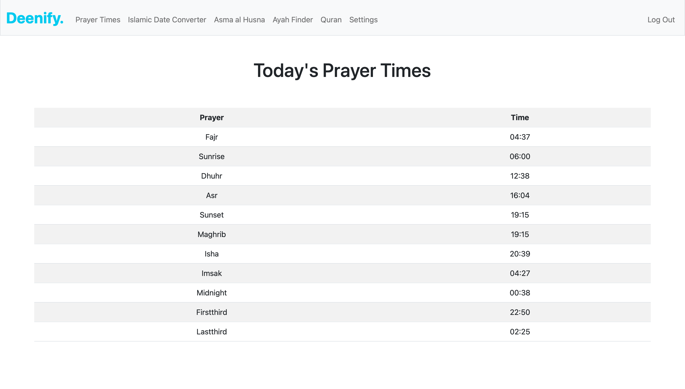
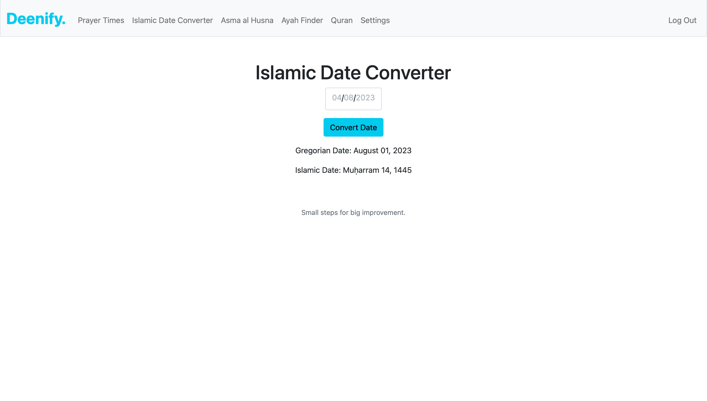
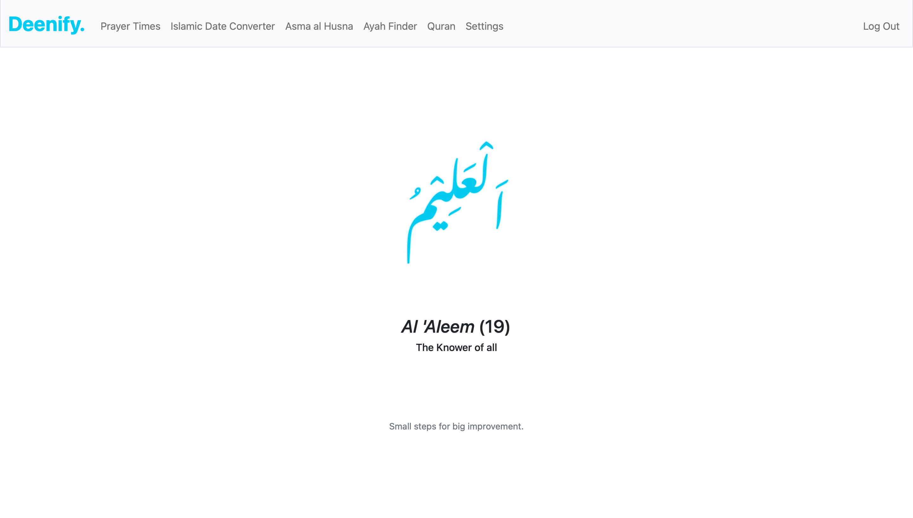
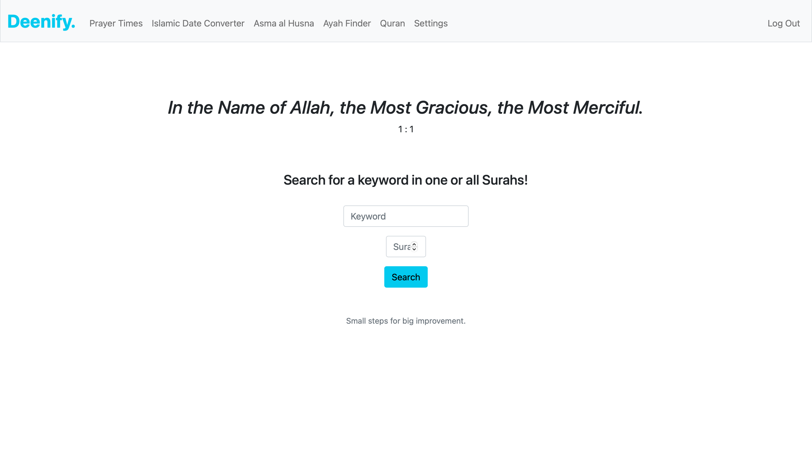
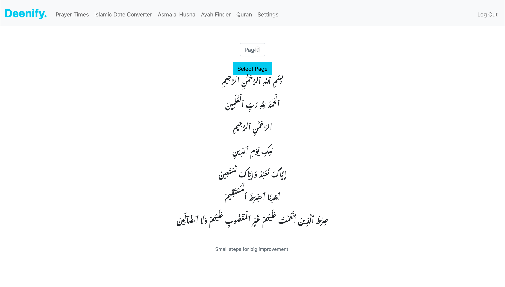
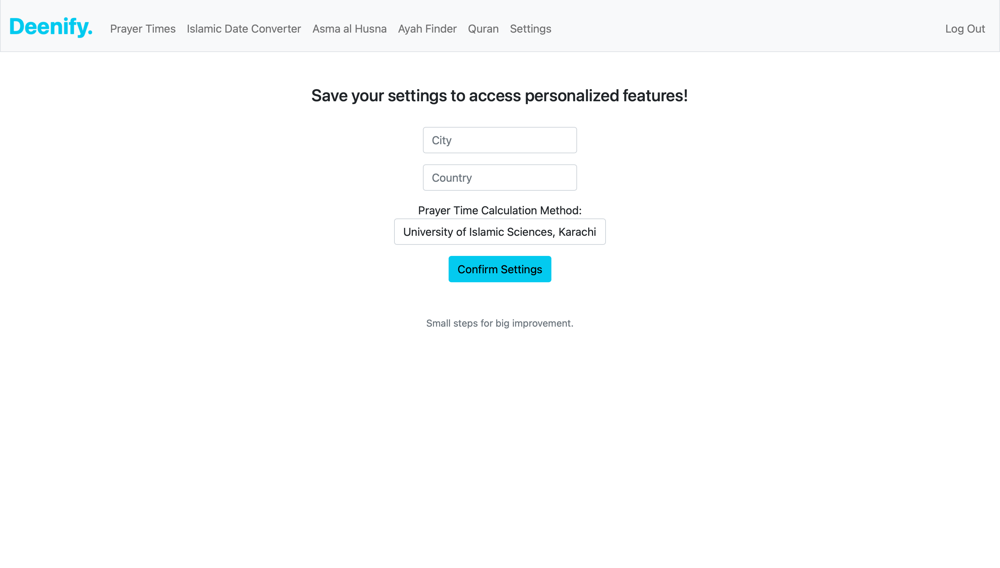

# CS50x Final Project: Deenify
#### Video Demo:  <https://youtu.be/vwSxA6MQVhg>
#### Description:

## Introduction
Deenify is a **Muslim lifestyle web app** that aims to assist Muslims during their daily lives. The app is inspired by other Muslim lifestyle apps such as Islam360 and Muslim Pro.

When I submitted **CS50 Finance**, I realized I needed to learn how to work with APIs. As a result, I ended up applying five different APIs in Deenify.

## Features
Deenify has 5 main features that call different APIs to do their bidding.

### **Prayer Times**
Muslims pray five times a day based on the position of the sun. These times have been calculated for every city based on solar angles for that particular day and the geographical location of the city.

The Prayer Times feature works by first asking the user to fill in their location and prayer time calculation method detail in the settings. Then, whenever the user visits the Prayer Times page, an API call is run that fetches data for that location on that day based on the calculation method chosen and displays the prayer schedule to the user. As a practicing Muslim, this is a feature that I use every day myself.

**Design Conflict**: I could have displayed the entire month’s prayer schedule as well, but it seemed too difficult to filter the necessary information from it.

### **Islamic Date Converter**
Along with the Gregorian calendar, Muslims also follow the Islamic (or Hijri) calendar. More often than not, it is an arduous task to keep track of Islamic dates or convert dates to Islamic dates. This feature allows the user to convert any date of their choosing to its Islamic counterpart. As a default, whenever the user visits the page, today’s date is displayed in both Islamic and Gregorian formats.

This conversion is possible because of an API that gets the Islamic date for the Gregorian date provided.

### **Asma ul Husna**
Asma ul Husna are the 99 names of Allah (God). This feature enables the user to view one of the 99 names of Allah in Arabic along with its English transliteration and translation. The name is randomly chosen from one of the 99 names.

The features work by generating a random number between 1 and 99 and then calling the API for the name on that number along with its translation and transliteration. It gives a different result each time to remind Muslims of the numerous qualities of Allah.

**Design Conflict**: All 99 names of Allah could also have been displayed on a single page, but I felt that it feels more exciting to discover a new name each time. The bigger Arabic font also makes the page more visually appealing.

### **Ayah Finder**
Ayah Finder is a search function that searches an Ayah (verse) of the Holy Quran based on the provided keyword and surah (chapter) number. It gets the first verse in that chapter with the matching keyword.

If the user wishes to search for a verse in all 114 chapters of the Holy Quran, they can simply not enter a number for the chapter, and the result would be rendered from all 114 chapters. The reference for the verse is also delivered through the API and is displayed right under the translated text of the verse.

**Design Conflict**: I initially had nothing on the page when the user first visited it, but it seemed a bit empty. Therefore, I decided to display the first verse of the Quran whenever the page was accessed through the GET method. Not only is this more visually appealing, but it is a verse that Muslims use whenever they start something new (i.e. search of a verse in this case).

### **Quran**
A standard copy of the Quran comprises 604 pages. This feature allows the user to read Arabic from any one of those pages by simply entering the page number for the desired page.
The feature runs an API call that gets the Arabic text for that page and displays it to the user.

**Design Conflict**: The API’s results gave the entire Arabic text as a single line. I had to work around it a bit to break it into multiple lines, similar to the original copy of the Quran.

## Essential Components
Apart from the features that are calling different APIs, there are other essential components to the website as well.

### **Settings**
The settings page allows the user to update their City, Country, and Prayer Time Calculation method (there are five methods available on the app).

The settings are updated on a database using sqlite3. The default values for City, Country, and Method are Karachi, Pakistan, and the University of Islamic Sciences, Karachi.

### **Register**
This component is the same as the one found in CS50: Finance. It saves a user’s username and password on a database using sqlite3. This is the same database that was used to save the user’s settings. The database comprises a single table that holds the user’s ID, username, password, city, country, and method.

### **Login**
Like its predecessor, the Login function is also the same as the one found in CS50: Finance. It accesses the aforementioned database and logs the user in if their credentials match. The user’s settings are saved in the database and are retained for whenever the user logs in again.# Deenify
